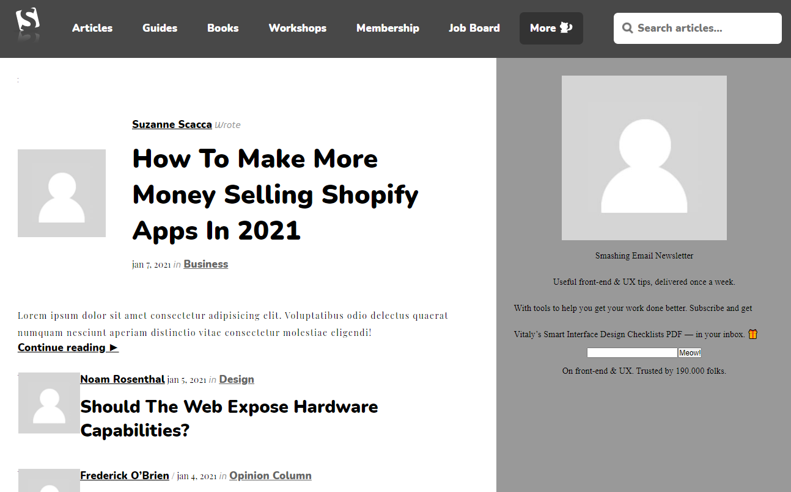

# News Information Page - The New York Times Clone

> We created a clone of a view of The New York Times portal from scratch.

Smashing Magazine Clone
This web page was project number 5 of the microverse curriculum.
In this project we try to show the visual importance of the elements contained in it.

## Built With

- HTML5
- CSS3
- Git
- Github
- Lintern
- VSCode

## Live Demo

[Live Demo Link](https://aristides1000.github.io/design-teardown/)

## Getting Started

This project was created with the purpose of studying the importance of the visual weight of the elements on a web page and its influence to capture the attention of users.

### Prerequisites

Computer running Mac OS, Windows, or Linux Ubuntu. Internet browser: Firefox, Google Chrome, Opera...

### Install

Download the code or copy the git repository to your computer.

### Usage
Run the index.html file.

### Run tests
Linters errors

## Authors

👤 **Author1**
Aristides Jose Molina Pérez

- GitHub: [@aristides1000](https://github.com/aristides1000)
- Twitter: [@aristides_1000](https://twitter.com/@aristides_1000)
- LinkedIn: [aristides jose molina perez](https://www.linkedin.com/in/aristides-jose-molina-perez-09b0579a)

👤 **Author2**
Daniel Ufeli

- GitHub: [@danielufeli](https://github.com/danielufeli)
- Twitter: [@danielufeli](https://twitter.com/danielufeli)
- LinkedIn: [daniel ufeli](https://www.linkedin.com/in/danielufeli/)

## 🤝 Contributing

Contributions, issues, and feature requests are welcome!

Feel free to check the [issues page](https://github.com/aristides1000/design-teardown/issues).

## Show your support

Give a ⭐️ if you like this project!

## Acknowledgments

Ariel Camus CEO Microverse: For letting us start this journey
Google: For letting us find crucial information in order to create this project
